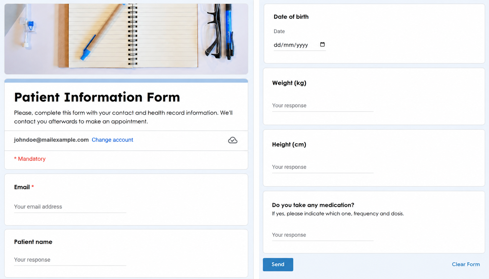

# google-workflow-automation
End-to-end administrative workflow automation for a medical practice using Google Apps Script, Forms, Sheets, Docs, Drive and Gmail.

## 📌 Project Overview

This project was designed to automate a previously manual administrative process involving patient data collection, document generation, record management, calculations, and follow-up communications.

The solution connects Google Forms, Google Sheets, Google Docs, Google Drive, and Gmail through Google Apps Script, creating an automated workflow from data submission to scheduled email reminders.

## 🔄 Workflow

Google Form  
↓  
Google Sheets  
↓  
Google Apps Script  
↓  
Google Docs + Google Drive  
↓  
Automated calculations and record updates  
↓  
Scheduled email reminders

## Workflow Demo

The following screenshots illustrate the end-to-end workflow, from the initial setup and patient data collection to automated document generation and follow-up.

### 1. Workflow Setup

The solution uses a structured Google Drive environment to connect the form, response spreadsheet, document template, and generated records.


### 2. Patient Data Collection

The workflow begins when a patient submits their information through a Google Form.



### 3. Medical Record Template

A predefined Google Docs template contains placeholders that are dynamically replaced with the submitted information.


### 4. Form Submission

Once the form is submitted, the Apps Script automation is triggered and processes the submitted data.


### 5. Automated Document Generation

The workflow automatically creates a new medical record based on the predefined template and stores it in the designated Google Drive folder.


### 6. Generated Medical Record

Form responses and automatically calculated information, such as age and BMI, are inserted into the generated document.


### 7. Centralized Record Tracking

The Google Sheets response database is automatically updated with a direct link to the generated document, the expiration and reminder dates are calculated in this sheet.


### 8. Automated Email Reminder

A scheduled Apps Script process reviews reminder dates and automatically sends personalized follow-up emails when action is required.


### 9. Reminder Status Update

After the email is successfully sent, the corresponding record is automatically marked as processed, preventing duplicate reminders.


## ⚙️ Key Features

- Captures information submitted through Google Forms.
- Automatically generates a personalized Google Docs file from a predefined template.
- Replaces document placeholders with submitted form data.
- Calculates derived information automatically, such as age and BMI.
- Stores generated documents in a designated Google Drive folder.
- Creates a direct link to each generated document in Google Sheets.
- Automatically calculates expiration and reminder dates.
- Runs scheduled checks to identify upcoming or overdue renewals.
- Sends personalized email reminders automatically.
- Prevents duplicate reminders by recording when an email has already been sent.

## 💻 Technologies Used

- Google Apps Script / JavaScript
- Google Forms
- Google Sheets
- Google Docs
- Google Drive
- Gmail
- Time-driven and form-submission triggers

## 💡 Business Impact

The automation reduces repetitive manual work and minimizes the risk of errors associated with manual data entry and follow-up tracking.

It centralizes information across Google Workspace and creates a consistent workflow for document generation and deadline monitoring, allowing administrative users to focus on higher-value activities instead of repetitive tasks.

## 🔐 Privacy & Data Protection

This repository contains a sanitized version of the original solution.

All identifying information, file IDs, contact details, medical practice information, and patient data have been removed or replaced with generic placeholders. No real patient information is included in this repository.

## 📂 Repository Structure

```text
google-workflow-automation/
│
├── README.md
├── form-document-automation.gs
├── email-reminder-automation.gs
└── screenshots/
```

## 🚀 Project Purpose

This project demonstrates practical experience in:

Process automation
Workflow design
Google Workspace integration
Data processing
Automated document generation
Scheduled task execution
Process improvement
Error reduction and administrative efficiency

---

Developed as a practical workflow automation project using Google Apps Script.
